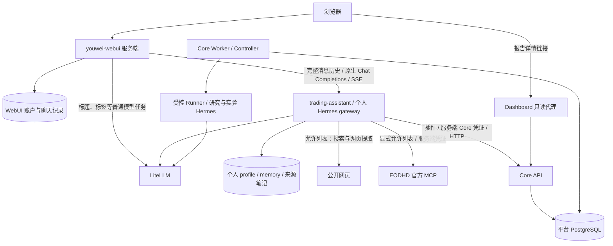
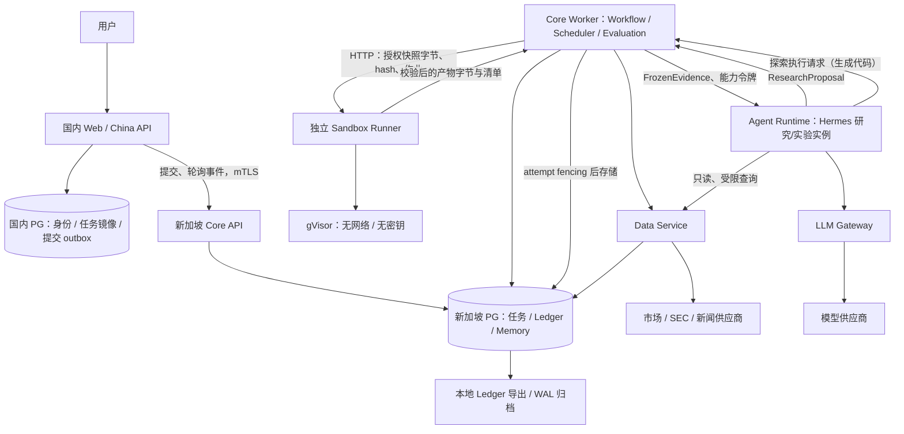

# Hermes 美股助手与研究平台技术架构 v0.3

日期：2026-09-28（仓库边界与现行部署约束同步）；2026-10-01（MVP 暂缓 Pi，Hermes 唯一 Agent 框架）；2026-10-04（三仓库职责、个人助手与升级边界）\
状态：三仓职责已拆分，平台与个人助手已有部署记录；正式前向评估与后续能力按实施计划逐项验收\
输入：用户提供的 v0.2 架构；详细问题见 [v0.2 评审](archive/ARCHITECTURE_REVIEW_v0.2.md)\
适用范围：已确认自用或受控内部研究，不向公众提供服务、不自动交易、不对外提供投资建议；目标为中国大陆入口与新加坡核心。现有 SG 主机为 DigitalOcean 4 vCPU / 7.8 GB，国内入口尚待接入。范围扩大按第13节重新评估。

本文是当前架构设计依据。[实施计划](IMPLEMENTATION_PLAN.md)记录依赖顺序、交付物与实际验收；[仓库边界](REPOSITORY.md)说明代码职责、依赖环境和外部组件接入方式。架构要求不代表代码、部署或安全验收已经完成。

S00 的具体选择登记于 [protocols/](protocols/README.md)：固定20证券样本、D1/D20/D60、D20主目标、SPY、周六06:00 ET截止及下一交易时段开盘入场；固定目标窗口停牌政策与描述统计优先的区间方法已确认（2026-09-27）。EODHD 当前成员采集与抽样已通过开发验证；分类采用 `eodhd_sector` 的建议已写为候选 v2。该段描述协议演进背景；实际采用的样本、模型、许可和人工批准以 Trial/ResearchRelease/Campaign 登记及实施计划为准，不能由早期冒烟推导当前就绪状态。

## 0. v0.2 → v0.3 修订摘要

| 顺序 | 合并的修复与优化 | 本文位置 |
| --- | --- | --- |
| 1 | 区分数据截止、封存检查、持久提交确认与实际入场 | 第 4–5 节 |
| 2 | 区分来源公开时间、系统可用时间和历史重建；冻结数据与训练版本 | 第 3–4 节 |
| 3 | 使用 campaign/case 预登记全量样本，记录缺失与降级，三组严格配对 | 第 5–6、8 节 |
| 4 | Outcome 更正追加版本，评估固定版本清单；Ledger 受控提交与独立归档 | 第 6 节 |
| 5 | Memory 内容版本、状态事件与上下文快照分开；堵住候选 Lesson 间接注入 | 第 7 节 |
| 6 | 确定性 Workflow 管执行；PG 任务、租约、幂等和 outbox 管恢复 | 第 2–3、9 节 |
| 7 | 标准量化绕过 Agent 模型循环；生成代码的探索由 Hermes 实验实例发起，Pi 暂缓接入 | 第 1–3 节 |
| 8 | 六个 SG 应用部署单元、国内持久库、轮询事件和明确出口 | 第 2、9–10 节 |
| 9 | 沙箱输入/输出、Agent 工具与管理面、租户权限分别约束 | 第 10 节 |
| 10 | 均值/分位数使用匹配评分；注册试验；LLM 变更做前向对照 | 第 8 节 |
| 11 | 人工批准 research release，覆盖 prompt、模型、工具、Memory 与降级策略 | 第 7–8 节 |
| 12 | 恢复目标、故障验收与真实标签等待时间 | 第 11–12 节 |

上表按设计主题整理；实际开发遵循实施计划中的依赖顺序，持久任务与安全执行基础必须先于正式研究任务。

## 个人助手交互入口（2026-10-04）

主要聊天入口采用 `youwei-webui → 独立 Hermes 原生 gateway → LiteLLM / 受限工具`。`youwei-webui` 是用户已创建的 Open WebUI fork；持续定制界面和交互由该仓库承接，平台业务仍集中在 `youwei-trading-agent`。

| 组件 / 仓库 | 负责内容 | 权威数据与限制 |
| --- | --- | --- |
| youwei-webui | 登录、聊天界面、聊天历史、流式展示；上游界面定制和镜像构建 | WebUI 数据库保存账户与聊天；不作为 Core 任务状态或正式研究记忆的权威 |
| youwei-trading-agent | Core、quant、contracts、Runner、研究/实验 Hermes 适配、跨服务部署与备份调度 | PostgreSQL 管理平台任务、报告、PIT 与 Ledger；固定外部镜像及兼容组合 |
| trading-assistant（个人 Hermes gateway） | 自由问答、搜索与网页读取、平台工具调用、个人知识沉淀 | 独立 Python 3.13、持久 profile、会话数据库、memory 与知识卷；不直连业务数据库 |
| Core / Controller | 服务端身份与权限、PIT 行情、持久研究、冻结输入及受控提交 | 任务状态、幂等、租约和 fencing 均由 Core 决定 |
| 研究 / 实验 Hermes | 在 Controller / Runner 授权链路中消费受控输入并返回提案 | 与个人助手分离配置、凭证、profile 和工具权限；不能自行封存正式预测 |
| LiteLLM | 所有模型调用的统一出口 | 聊天后台任务、个人助手与研究使用各自的服务端凭证 |
| Dashboard | 完整报告、证据和前向评估详情 | 消费 Core 只读接口；保留已有入口，后续内嵌 UI 不复制业务状态 |

### 个人聊天与平台调用链



WebUI 服务端通过 Hermes 的 `GET /v1/models` 发现模型，以 `POST /v1/chat/completions` 传递完整历史并接收原生流式响应；不为每条消息启动 CLI 子进程。标题、标签等后台任务直接走 LiteLLM 普通模型，模型发现失败也不得回退到 Hermes 执行工具或写记忆。

Hermes 平台插件使用以下 Core 接口；浏览器和模型参数均不提供 Core 身份：

| 能力 | Core HTTP 接口 | 语义 |
| --- | --- | --- |
| 日线 | `GET /v1/data/daily-bars` | 证券、日期范围、可选 as_of；默认截止时间由 Core 确定，返回来源、可用时间和质量，不称为实时行情 |
| 研究提交 / 列表 | `POST /v1/research` / `GET /v1/research` | 提交证券与 D1/D20/D60 窗口、可选基准；当前不支持任意问题正文 |
| 状态 / 报告 | `GET /v1/research/{research_id}` / `GET /v1/research/{research_id}/report` | Core 校验归属，报告可按版本读取 |
| 取消 | `POST /v1/research/{research_id}/cancel` | 显式取消持久研究任务 |

自由问答不强制创建 Core 作业。需要平台研究时返回持久 ID、摘要及现有 Dashboard 报告链接；提交传输重试复用运行时 session/turn/tool-call 身份生成的幂等键，新调用不因文字相同永久去重。普通聊天不承诺断线或重启后自动续跑；前端停止响应不等于取消已经提交的 Core 任务，任务继续由 Worker 管理。

首版仅当前单所有者可访问。WebUI 到 Hermes、Hermes 到 Core 的凭证分别留在服务端；不向浏览器暴露服务 key，不共享数据库或宿主目录来交接任务。未来 fork 内嵌研究进度卡片时，由 WebUI 服务端的鉴权适配访问 Core，仍以 Core 为权威；这是后续能力，尚未实现。新增用户前必须重新设计身份映射和 profile 隔离。

个人偏好使用 Hermes memory，带来源长篇笔记使用限定目录知识工具。个人知识不自动进入正式预测输入；正式研究供应商访问经 Core。个人助手按用户授权直连 EODHD 官方 MCP，仅开放搜索、证券解析、历史行情、报价、基本面、新闻和财报日历七工具，返回结果不自动形成 PIT 快照或 Ledger 输入。公开网页检索由受限工具执行，不开放通用宿主终端或内置代码执行。工具与备份操作见 [个人助手接入](ops/hermes-personal-assistant.md)。

状态区分：三仓库源码职责已拆分；2026-10-04 按用户授权把 youwei-webui v0.11.4、独立个人助手和 Core API 部署至 sg-prod。新组合已通过 VM mock 链路、无网络旧数据迁移、线上只读检查与完整备份隔离恢复，见 S12h 和[部署记录](ops/three-repo-vm-rollout-20261004.md)。未调用真实付费模型，未执行正式前向评估；Worker、Runner、研究镜像及正式 release 约束保持原状。 随后按用户选择将个人助手切到官方 v2026.9.24 / Python 3.13，目标机数据副本及 WebUI 兼容通过，详见[个人助手 Release 切换](ops/hermes-release-20260924-rollout.md)。

## 1. 关键决策

个人查询的后续部署：EODHD MCP 已按用户授权在 sg-prod 上线，固定七项查询工具；当前套餐可用范围、验收证据和镜像回滚见 [EODHD MCP 记录](ops/eodhd-mcp-rollout-20261004.md)。该接线不改变下述正式研究协议。 2026-10-05 的十九工具扩展候选已实现：增加盘中历史、公司行为、情绪/词频、技术指标/筛选、商品/国债与短时实时采集，移除基本面和财报日历。服务端限制时间范围和采集规模、拒绝凭证覆盖，MCP resources/prompts 关闭。账户验收有三项套餐拒绝及实时连接失败，尚未切换生产；当前七工具部署继续有效，详见[候选验收](ops/eodhd-extended-20261005.md)。

保留 v0.2 的 PIT 数据、三组预测、前向评估、独立记忆、沙箱和人工发布原则。优先让一次预测从计划、封存到评分都具有严格语义，再扩展研究角色与实验能力。

| 事项 | v0.3 决策 |
| --- | --- |
| 调度 | Workflow Controller 是确定性代码，管理持久任务、截止时间、权限和提交；Hermes 是唯一研究 Supervisor |
| Hermes | 生成计划、组织研究、综合与反驳；输出 Proposal，由 Controller 校验并提交 |
| Pi | MVP 暂缓接入；保留为可替换的实验 Agent 适配器候选（版本锁不变）。需要生成代码的探索由独立 Hermes 实验实例实现，标准 event study / factor / model 走确定性任务 |
| 模块组织 | Core API、Workflow、Ledger、Memory、Evaluation 共享代码库；按运行权限和资源需求部署 |
| 计算与执行边界 | 纯 quant 计算独立于 Ledger；共享 contracts 不依赖数据库；Sandbox Runner 独立进程且无数据库及供应商凭证 |
| 存储与归档 | MVP 使用 PostgreSQL 与受控本地文件；OSS 不在 MVP 范围；本地归档不提供独立防篡改或 WORM 保证 |
| 队列 | MVP 使用 PostgreSQL 任务表、租约与事务 outbox；Redis 暂不承担正确性责任 |
| 跨境通信 | 国内提交 + 主动拉取持久事件；回调在确有延迟需求后再加 |
| 数据可见性 | 区分“当时公开”与“系统当时实际知道”；正式前向任务只用冻结输入 |
| 正式预测 | 预登记 campaign 与每个 forecast case，封存截止时间早于入场 |
| 预测与结果 | 预测只追加；结果按 outcome revision 追加；评分在 Evaluation 派生 |
| 记忆 | 内容版本和状态事件分别追加；正式预测只接受已批准的上下文版本 |
| 进化 | 量化策略可历史验证；含 LLM 的改变必须前向 shadow；人工批准整套 research release |
| MVP 范围 | 登记日 S&P 500 总体，按声明分类分层固定种子抽样20证券；v1 登记 GICS，候选 v2 改用 eodhd_sector；每周批次；D1/D20/D60、D20为主；SPY；一套简单量化模型 |

20只是管线验证的初始规模，不保证统计功效。样本跨周固定，退出指数、退市或缺数据不事后换股。[campaign-policy.v1](protocols/campaign-policy.v1.md)及其 hash 保留；[候选 v2](protocols/campaign-policy.v2.md)明确供应商分类及源证据/映射/抽样的一致性要求。未来实际采用的版本必须绑定到人类批准的具体 release hash；11个供应商板块不证明与官方 GICS 等价。

## 2. 逻辑与部署



上图表示正式平台的目标职责和信任边界，与前述个人聊天链路区分；各单元实际接入及验收状态以实施计划为准。当前原始数据、冻结快照与受限小产物保存在 PostgreSQL；本地 Ledger 导出和 WAL 归档分别管理。大对象存储以后按容量和许可选择，MVP 不依赖 OSS。

国内目标部署：

- nginx、Web 入口、China API；主要聊天界面已选 youwei-webui，国内入口及 China API / 任务镜像属于目标拓扑，不因 fork 创建而视为已部署；
- 独立小型 PostgreSQL：身份、租户成员关系、task mirror、提交 outbox；备份保存在境内；
- Redis 仅在缓存或会话性能确有需要时添加。

新加坡按权限划分的目标部署单元：

| 单元 | 职责及限制 |
| --- | --- |
| core-api | 私有入口、鉴权、任务与事件查询、受控提交、产物存取；API 内部包含 Ledger / Memory 的受限操作 |
| core-worker | 同代码库的 Workflow / Scheduler / Evaluation；授权并冻结沙箱输入，通过 HTTP 调用 Runner，重新校验租约并保存产物，不持有容器运行时权限 |
| agent-runtime | Hermes 适配器（研究/实验实例）；无数据库凭证、无供应商密钥、无运行时 socket |
| data-service | 正式研究的数据供应商适配、采集、版本化与快照；当前在 Core 数据模块实现，独立服务接线随权限隔离推进；个人 EODHD MCP 查询单独由助手维护 |
| llm-gateway | 模型出口与请求级限额；模型调用费用不设预算账本（预算/计费维度已删除），外部调用的实际收费与内部观测由 Gateway／供应商记录为准 |
| sandbox-runner | 独立进程以固定模板创建 gVisor 作业；仅接收 Worker 授权并冻结的输入，不读业务数据库、不持有供应商密钥、不直接提交 Ledger 或保存业务产物 |

另有 nginx、PostgreSQL、受控备份任务。上述平台业务职责保留在 youwei-trading-agent，界面 fork 位于独立 youwei-webui 仓库，按权限需要独立运行；MVP 不要求提前启动所有目标单元。Hermes 通过版本化契约接入；Pi 保留为可替换候选但暂缓接入，外部 Agent 的业务接入仍属 S07/S08。

较重的标准量化计算也在批处理沙箱执行，但使用已发布的 quant 镜像和固定入口，不调用 Agent 模型循环。轻量评分可在 core-worker 执行。

本方案仍是单节点 Core，不承诺高可用。现有 SG 主机为 DigitalOcean 4 vCPU / 7.8 GB，见 [目标机记录](research/s01-target-verification.md)。先限制重计算并发为1，保留数据库资源，配置小连接池与每进程内存上限；实际容量和 RPO/RTO 在 S09 目标机验收。两台服务器的旧原型已归档并移除，原型的存在或曾运行成功不作为当前业务接入证据。

### 2.1 仓库与依赖边界

Core 保留一个业务包及一条迁移链，任务、租户、PIT、Ledger 的事务归 Core 管理。本次将纯量化模型提取到 quant，只接收显式输入并返回计算结果；Ledger 负责案例、版本、封存与评估记录。收益算术当前仍在 Ledger 的 outcomes 模块，后续扩展时沿纯计算边界提取。

共享 contracts 承载冻结输入、执行请求和产物清单等传输结构，不依赖 Core 数据库、HTTP 路由或供应商 SDK。Runner 使用独立依赖环境，只依赖这些结构和执行组件；Worker 保留数据库授权及有副作用的提交。具体包与验证入口见 [仓库边界](REPOSITORY.md)。

`youwei-webui` 独立维护 Open WebUI 源码历史、界面定制、构建及界面测试；`trading-assistant` 保留个人 gateway、插件、memory/知识工具、独立镜像及原生测试；`youwei-trading-agent` 保留研究/实验 Hermes、Core 接口、跨服务接线与兼容验收、部署锁和整体备份调度。三仓通过 HTTP 契约与固定镜像交付，不相互导入业务实现。Agent 工作台使用 WebUI 服务端指定所有者鉴权，代理 Hermes 原生会话、运行与 cron 接口；技能正文由助手镜像内的只读服务提供。日历只投影 Hermes 最近/下次运行，不复制调度任务。单业务仓库约束继续适用于平台领域规则，不要求把界面上游源码放进 Core。

界面先通过配置禁用能力、精简导航，再按需求修改组件；隐藏入口不代替服务端权限控制。初期保留上游认证、聊天存储和迁移机制，以兼容旧聊天和后续升级。Hermes 等其他上游仍优先使用官方固定版本与扩展，必要源码补丁登记基线、原因和移除条件。

### 2.2 上游版本与发布职责

| 项目 | 版本维护与升级方式 | 发布边界 |
| --- | --- | --- |
| youwei-webui | develop 承接原 youwei 定制基线，作为默认协作分支；删除 main，保留旧 youwei 历史；升级临时分支从 develop 创建后合并官方目标 Release | fork 构建自己的镜像；平台固定上游 tag/SHA、fork SHA、镜像 digest 和兼容证据后部署 |
| 个人 Hermes gateway | trading-assistant 固定官方 Release 与完整 SHA、独立 Python 3.13 环境、上游 frozen 依赖锁及插件版本；平台消费助手 commit 与镜像 digest | 独立候选、镜像和 profile；可先升级个人助手，不连带更换正式研究运行时 |
| 研究 / 实验 Hermes | 平台仓库维护受控适配、源码补丁与工具契约，单独登记已验证版本 | 评估 ResearchRelease 影响并遵守既有审批；不得替换已批准预测环境或改写历史记录 |

每月检查正式 Release，安全修复及时评估。Sync fork 只同步源码；部署必须使用已验证的固定版本，不自动跟随 main/latest。两个 Hermes 运行面可以使用不同的已验证版本，每次记录差异与兼容组合；本次文档决策不选择新的上游版本。

当前两个 Hermes 构建基线均为 `7fa45eb349a1a6f1eebc010b3fef0a9d996f386a`。个人 gateway 无上游补丁；研究镜像有实际返回模型归因补丁，升级必须复核语义与移除条件，`git apply --check` 成功不等于兼容。Core 继续 Python 3.13，不能因 Hermes 升级而改变其解释器。

统一升级流程为：选定候选并记录差异 → 隔离构建与契约测试 → 用备份副本验证迁移及恢复 → 目标机验证 → 固定镜像与部署清单 → 按授权切换。验证覆盖聊天/流式/后台分流、工具与权限、持久知识；研究运行时另验冻结证据、能力令牌、归因、取消及提案契约。正式研究行为变化按第 7–8 节处理，不由工程兼容测试代替批准。

回滚先判断旧版本能否读取升级后的数据库、会话和知识格式；必要时恢复升级前的对应数据副本，并明确恢复点之后的数据处理方式。保留上一套镜像、配置、锁和备份，不通过恢复正式 Ledger 来回滚聊天入口。具体升级矩阵、补丁与验证入口统一维护在 [上游管理](UPSTREAMS.md)，运行验收证据维护在实施计划。

## 3. 四个核心 Interface

### 3.1 冻结证据

```text
Evidence.materialize(query, knowledge_context, principal) -> FrozenEvidence
FrozenEvidence = data_manifest + memory_manifest + release_id + content_hash
```

时间、租户和范围由 Controller 签发，不能由模型覆盖。研究查询必须显式带时间上下文；禁止正式路径默认采用 now。同一研究的 Market / Fundamental / News 与 quant 使用同一组 manifest。

### 3.2 研究

```text
ResearchRuntime.propose(plan, frozen_evidence) -> ResearchProposal
```

Proposal 包含结构化事实引用、研究观点、反证、量化调整、warnings 和使用的工具结果。它没有直接写 Ledger、改变 Lesson 状态或发布策略的能力。

事件概率不代表证据充分程度；另外记录 data_quality、样本量、模型适用性与 insufficient_evidence，避免用一个主观 confidence 数字混合这些概念。

### 3.3 执行

```text
Execution.submit(job_spec, authorized_snapshot_refs) -> job_id
Execution.status(job_id) -> state + validated_artifact_manifest
Execution.cancel(job_id, attempt_token) -> cancellation_result
```

标准 quant 与探索生成代码共享执行约束。调用方不能指定任意镜像、宿主路径、挂载参数或网络模式。

独立 Runner 的 HTTP 契约：标准执行面为 `POST /v1/executions`、`GET /v1/executions/{job_id}/{attempt_no}` 和同路径 `DELETE`；研究面为 `/v1/research-invocations`；受控探索的实验面为 `/v1/experiment-authorizations`（控制面）、`/v1/experiment-computations`（工具面）与 `/v1/experiment-invocations`（实例派发）。Core Worker 校验作业及快照授权，推送冻结内容和 hash；请求签名绑定 tenant、job、attempt、请求体 hash 及租约截止时间。Worker 持续轮询并按协议续租，Runner 在租约或执行时限到期后停止计算。Runner 返回经过边界校验的产物字节和清单，Worker 在当前 attempt 的 fencing 检查通过后保存业务产物。实验面的授权登记与计算回执在 Runner 侧持久化（追加式存储；重启后 running 改写为 failed(interrupted) 留痕，同 id 幂等重放，绝不静默重执行）；业务状态的权威仍是 Core 的 PG 登记/接纳表，Runner 回执仅是执行证据。

### 3.4 封存

```text
Ledger.seal(case_id, release_id, source_results, provenance, attempt_token) -> commit_id
```

内部一次校验：权限、截止时间、租约、数据版本、source 完整性、值域、幂等与链头。合法结果在一个短事务中提交；Hermes 不自行拼接 hash 或时间戳。

## 4. 时间、数据与可复现

保留 event_time / published_time / ingested_time，进一步明确：

- source_available_at：有证据支持的外部可获得时间，含时区、供应商版本与精度；
- usable_at：该版本在本系统完成接收和必要校验后真正可供研究使用的时间，不早于接收；
- decision_cutoff：输入的信息截止时间；
- sealed_at：取得必要锁后，由数据库实时钟记录的封存检查时间；提交及时性另有确认记录；
- prediction_deadline / entry_at / exit_at：由目标契约和交易日历确定。

前向研究同时满足 source_available_at <= decision_cutoff、usable_at <= decision_cutoff，并固定具体数据版本。源时间缺失时使用保守的可用时间与质量标记，不能假装历史已有数据。

历史量化模拟可以采用经过核实的 source_available_at 重建“当时市场可见”的数据，但必须标明 historical_source 模式；它不能冒充本系统当时真实运行的记录。回补数据的 ingested_time 保留实际回补时间。只有日期而没有盘中发布时间的记录，按预登记的保守规则处理。

PIT 不仅适用于原始行情与财务，还包括：

- ticker 变更、证券合并、退市、股票池成员；
- consensus EPS / revenue、forward PE、IV、市场状态等特征；
- 新闻修订、财报重述、派生特征的所有依赖；
- 标准化、缺失值处理、特征选择、概率校准的拟合窗口；
- 模型训练所用标签在训练截止前是否已经到期并可用。

没有历史 consensus 或 IV 授权时，event study 必须缩减特征并报告缺失，不用当前值回填。

派生特征可在 cutoff 后计算，但所有输入必须来自 cutoff 时冻结的版本，计算代码也固定。在线请求可先完成必要采集，再选定并封存 decision_cutoff；不能一边生成预测一边吸收 cutoff 之后的新事实。

Snapshot manifest 至少保存：查询、时间模式、证券集合、原始对象版本、schema、行数、文件 hash、供应商及授权标签、特征版本、代码与镜像 digest。对象使用不可变键或精确版本引用。报告包含引用到段落/页码/表格的 evidence_ref。

模型另有 training_manifest：训练/验证快照、成熟标签截止时间、预处理与校准器、折分与参数搜索记录、模型文件 hash。数据 PIT 正确不代表训练过程无泄漏。

承诺复现当时的输入、量化运算与已记录的输出；不承诺再次调用外部 LLM 可逐字重现。保存实际请求、工具响应、模型返回、采样参数、provider/model 标识与安全必要的脱敏记录。

## 5. 预测契约与截止时间

TargetSpec 是可复用、版本化的目标定义，固定：

```text
target_spec_id
benchmark_policy
exchange_calendar_version / timezone
horizon_td
entry_rule / exit_rule / deadline_rule
return_convention / corporate_action_policy / missing_price_policy
```

每个 forecast case 将规则解析为具体实例：target_spec_id 及内容 hash、security_id、benchmark_security_id、decision_cutoff、prediction_deadline、entry_session、exit_session、entry_at、exit_at。campaign 固定 TargetSpec 引用，批次开始前封存实例字段；不能修改 TargetSpec 后让旧 case 指向不同目标。只有目标定义和实例窗口相同的不同 release 才能共享 case/Outcome；benchmark、horizon 或收益口径变化必须创建新 case，不作为同 case 的模型对照。

定义 excess_return = security_total_return - benchmark_total_return。两者使用同一持有窗口；第一个持有交易日为 D1，N=1 在 D1 收盘退出，N=20 在 D20 收盘退出。

“下一交易时段”明确为下一次常规交易时段的开盘，不含盘前盘后。美东时区、夏令时和提前收盘由版本化交易日历处理。真实交易模拟另加成交、成本与滑点模型。

首版集合为1、20、60交易日；D1/D60仅作探索性切片。每周六06:00 America/New_York 冻结输入，deadline 为入场常规开盘前15分钟；普通周约有51小时15分钟调度窗口，DST和假日由日历解析。该窗口不替代单run超时。详见 [time-protocol.v1](protocols/time-protocol.v1.md)。

system campaign 登记时间规则；每个 Batch 在开始前解析并封存具体 cutoff、deadline 与入场时段，必须满足：

```text
decision_cutoff <= sealed_at <= prediction_deadline < entry_at
```

错过截止时间的任务记为 late/missing；不能为了保留好看的样本事后更换入场时段。session 研究若需要重订目标，创建新 case 并显式展示新时间；原 case 仍保留。

实现中必须在取得 case/chain 锁后使用数据库 clock_timestamp() 检查当前时间、租约与 attempt，不能使用代表事务起点的 now()。写入采用短事务超时并保留入场安全间隔；只有在 deadline 前收到持久提交成功确认的结果才可计为准时。确认时间和资格判定追加为审计事件；未确认或晚确认的记录保守标记 uncertain/late，即使业务行已写入也不冒充准时。sealed_at 本身不声称是数据库提交完成时刻。

截止后拒绝新的预测写入，迟到提案仅保存为 attempt 审计产物。已经提交但确认不及时的预测保持原内容并排除出准时集合；幂等重试仅返回原 commit，不自动把 uncertain/late 升级为准时。

收益计算使用原始价格和持有期间的公司行为规则，或经验证的等价总收益数据。明确分红再投资时点、并购对价、拆分与退市终值。未知退市终值不能任意填 0 或当作普通缺失删除，应记录 unresolved 与估值依据，并在评估中披露。

expected_excess_return 不能单独确定 target_price：还缺 benchmark 预期收益及分红等假设。MVP 不展示由该字段直接推导的目标价。

## 6. Campaign、Ledger 与 Outcomes

最小逻辑模型：

| 表/对象 | 关键语义 |
| --- | --- |
| research_releases | prompt、角色/DAG、LLM、quant、特征、memory policy、工具、降级策略的不可变版本组合 |
| training_manifests | 训练清单：固定特征集及依赖、逐模型预处理、标签成熟规则、拟合窗口、校准与内容 hash 的模型产物；release 引用（ref+hash），campaign 注册时验证解析与一致性 |
| campaigns | 事前登记的多周研究计划：总体、股票池快照、TargetSpec、enabled_sources、频率与时间协议、主指标、缺失处理、生产 release 和可选 shadow release；不含具体批次时刻 |
| forecast_batches | Campaign 内一个 decision_cutoff 对应的周实例：具体 cutoff、prediction_deadline、entry_session 与该批计划 case；Scheduler 按周创建，漏跑/跳过也保留 |
| forecast_cases | 应当产生预测的批次内证券 × horizon（按 batch_id 归属）；失败也保留 |
| run_attempts | 任务尝试、租约、错误、耗时、原始模型响应引用 |
| forecast_commits | 对一个 case、一个 release 的 source 结果集进行原子封存 |
| forecast_commit_events | 追加持久提交确认、及时性判定及依据，保留 uncertain/late 记录 |
| predictions | 三个 source 的输出及实际状态、来源版本、证据与封存引用 |
| outcome_revisions | 结果的只追加版本、更正理由和前一版本引用 |
| evaluation_reports | 固定 case 集、outcome revision 集、评分程序和 release 的报告 |
| monthly_summary_reports | 月度汇总（campaign-policy §4.2）：按批次 cutoff 月份归属、批次等权聚合已登记的 D20 点估计；版本随标签成熟与更正追加，NA 不以 0 填充 |

一个证券 × 一个 horizon × 一个 release 通常对应 baseline / quant_model / llm_adjusted 三个结果；三个 horizon 是九个结果，不能仅以 run_id 配对。forecast_commits 唯一约束为 (case_id, release_id)，predictions 唯一约束为 (commit_id, source)。未来 champion/challenger 共享 case 与 Outcome，分别绑定不同 release；候选清单在运行前登记。

三个结果允许记录 source_status = produced / fallback / unavailable。unavailable 使用空值及错误原因，不能伪装成有效概率。降级政策在 campaign 前固定，例如 LLM 超时采用 quant；同时保存“原始 LLM 缺失”和“实际策略回退”两个事实。回退结果也必须在截止前封存，整个批次迟到则仍然缺失。

已登记政策：Phase 1A 不回退，任一来源失败记 unavailable；Phase 1B 的 LLM 失败/超时仅在同 case 有有效 quant 输出时回退 quant，且必须在 deadline 前完成。两阶段都不通过事后补写改善 coverage。

Phase 1A 尚未接入 Hermes 时，llm_adjusted 位置固定为 unavailable，reason=not_enabled；只能评估 baseline/quant，不计为 LLM 参与的三组对照。Phase 1B 从新的预登记 Campaign（含新 release）开始启用 LLM，禁止回补既有 case 的 LLM 预测，也不能仅在原 Campaign 的下一批次改变来源。

每个 campaign 在开始前登记 enabled_sources；not_enabled 表示未计划运行，不计为该来源的执行失败。来源 coverage 的分母是该来源事前计划参与的 case 集合，同时始终报告 campaign 的全量 case 数、来源启用情况与排除原因。

值域检查至少包括 0 <= p_outperform <= 1、有限数值、quantile 顺序、horizon 枚举、release 引用完整性；p 与 quantile 的明显矛盾也拒绝。v0.3 首先只输出概率与期望超额收益。封存边界同时强制证据纪律：produced 的 quant/llm 位置必须引用其计算所用的冻结证据快照，且快照必须是 as_of 不晚于该 case 截止时间的前向视图（historical_source 是重建，不作正式证据）；不消费证据的常量基线如实不引用。

Outcome 示意：

```text
outcome_id primary key
case_id
revision
supersedes_outcome_id
status: resolved | unresolved | unscorable
recorded_at
entry_at / exit_at / asset_return / benchmark_return / excess_return
prices_and_actions_snapshot_id
resolver_version / correction_reason
unique(case_id, revision)
```

修订链由受控写入操作串行校验，禁止同一前序分叉；当前结果是派生视图。一次真实收益供同一 case 的三种 source 及事前登记的不同 release 共用。Brier、MSE/RMSE 和分位数评分在评估层计算；修正结果后生成新评估报告，旧报告保持原引用。已 resolved 窗口的供应商数据更正由调度器扫描检测：候选查询（窗口内新观测版本）加与 head 冻结快照的精确证据比对（security、date、raw object 版本），仅在证据确实变化时重解析并追加更正版本；unscorable 是市场事实，保持粘滞。批次与月度报告的重生成由输入 digest 门控（缓存状态表，非 ledger），历史批次不随 tick 全量重哈希。

Ledger 对应用可验证且防止日常覆盖，不声称绝对防管理员篡改。应用不能 UPDATE / DELETE / TRUNCATE，迁移/owner 权限独立；受限提交接口防止任意 INSERT。哈希链需有 chain_id、单调序号、固定规范化方法和事务内链头锁。链头被外部归档之前仍存在信任窗口。

MVP 导出本地 Ledger 归档，包含封存记录、Outcome 更正、报告与链头；导出文件和 manifest 可检查内容一致性。它们位于同一管理权限下时仍可被一起重写，因此内容 hash、本地追加约定和本地 Git 均不构成独立防篡改锚点，也不具备 WORM 保留保证。

归档周期化、在独立控制的位置保存链头、验证引用数据恢复及明确保留权限，列入 S09 运维验收。OSS 不在 MVP 范围；未来是否采用对象存储或 WORM，按恢复目标、许可和成本单独选型，不能把本地导出标记成这些能力已完成。

## 7. Memory 与受控变更

将 memory_contents（内容版本）、memory_events（状态事件）、memory_snapshots（实际注入内容与版本）分开。状态事件记录 recorded_at / effective_at / actor / evidence_refs，禁止回溯生效。

查询 as_of 时，依据当时已存在且已生效的状态事件选取内容版本。不能用“created_at 在过去 + status 当前为 validated”代替历史状态查询。退役和替换同样用事件表示，避免后来修订改变过去的召回结果。

正式预测上下文只接受：

- 冻结的数据证据与被批准的研究规则；
- 当前 release 明确列出的 validated Lesson 版本；
- 如需既往 thesis，使用固定字段、固定选择规则，且把该召回政策纳入 release。

未验证 postmortem、candidate_lesson、自由文本失败总结进入研究工作台或探索任务；不得直接输入正式预测。仅给它们标注“背景”不能阻止 LLM 学习其中的建议。

从第一次允许 Lesson 改变正式预测起就要求人工批准。量化检验可支持 Lesson，但涉及 LLM 行为的 Lesson 仍需前向对照；训练数据污染不会因“只是记忆”而消失。

批准的对象是 research_release，覆盖 prompt、model、工具、数据/特征/降级政策、memory set 等全部影响预测的内容。任何 model 路由变更或 fallback 都在实际 provenance 中记录；无法固定的模型版本需注明。会话上下文和用户偏好不进入 system campaign。

最小 release manifest、人工批准记录和 trial 登记从首次正式 campaign 起存在；Phase 2 只补充审批界面与完整实验管理。Phase 1 的 memory manifest 可为空，正式 Lesson 功能保持关闭。新候选可按事前登记的协议运行 shadow，但不会自动替换已批准的生产 release。

冻结 release 中的 Lesson 不因后续退役或替换而被静默删改。正常调整发布新的批准 release；必须紧急撤销时暂停依赖该 Lesson 的未完成 campaign，再用新 release 创建新批次。已完成 case 的 memory snapshot 不变，原批次中的中止/缺失仍计入记录。

## 8. 评估与实验

Phase 1A 的主问题是同一预登记 case 集上的 quant_model 相对 baseline 是否改善。Phase 1B 在新的 campaign 上将主问题设为 llm_adjusted 相对 quant_model 的 Brier 是否改善，同步比较 quant_model 与 baseline，辅以均值预测的 MSE/RMSE、校准、Rank IC。启用来源和主问题在各自 campaign 开始前固定。

- baseline 首版可用 p=0.5、expected_excess_return=0；另有动量或历史基准率时独立标识，不能事后挑最弱基线；
- 概率必须来自冻结的、过去数据拟合的模型/映射，不能把任意动量分数直接当概率；
- 计算每个 case 的成对损失差，而不是比较不同样本集合的两个均值；
- 报告 coverage、失败、迟到、回退率；成功子样本的结论限定在该子样本；
- 分别评估实际降级政策的端到端表现与成功产生的原始 LLM 输出；
- 重叠 horizon 和同日股票的相关性都需处理；每周 D20 预测不能以1日独立块假定无重叠。Q7 已确认：v1 先仅描述统计，跨批区间用连续周批次区块自举，参数与样本条件事前登记后启用，此前不输出推断性区间；
- 概率评分改进不能直接等同于可交易收益。PnL 需要独立、预登记的持仓与成本规则。

不能为 unavailable 或 unresolved 随意构造概率/标签以凑齐评分。campaign coverage 使用预登记 case 全集，来源 coverage 使用该来源事前计划参与的 case 集合；损失指标注明实际可评分子集及其选择规则。缺失严重时只报告运行质量与描述统计，不据此声称预测有增量。异常价格、停牌、退市等不能通过事后删样本修饰结论。

评分必须匹配预测统计量：expected_excess_return 是均值，主要用 MSE/RMSE；q50 可用 MAE，分位数用 pinball loss。仅有区间覆盖率会鼓励扩大区间，需同时考察宽度或适当区间评分。[Gneiting 原始论文](https://arxiv.org/abs/0912.0902)

固定一项主指标和主 horizon，额外切片标注探索性。trial 登记从第一次用于选模型/改 prompt 的比较开始，记录失败与放弃的试验。Deflated Sharpe 对应收益策略选择问题，不能代替 Brier 改善检验。[原始论文](https://doi.org/10.2139/ssrn.2460551)

初期 trial 载体为 [docs/trials/registry.md](trials/registry.md)，采用追加约定与 Git 版本审计；本地 Git 不保证历史不可重写，正式运行前落实受控写入及独立归档。已登记试验与 release 批准的当前状态以 [实施计划](IMPLEMENTATION_PLAN.md) 为准，不在本文件重复维护。

纯量化策略使用训练、验证、purge/embargo、walk-forward 与独立 holdout。LLM 生成历史策略可能带入未来知识，所以历史结果仅用于筛选候选，正式能力依据仍然是后续 shadow。

“最近一段历史”只有在研究者、Agent 与调参流程确实未接触其信息时才可叫 holdout。一次使用后不能从已研究的历史中重新画一个框并宣称恢复独立性；新的最终评估窗口应等待未来数据积累。Evaluator 访问最终样本，Evolution 不获得逐条反馈；预登记查看次数及晋级规则。

至少跟踪证据支持率、引用准确性、关键事实错误、完成率与延迟，分别判断研究工具价值和预测增量。没有预测增量时仍可保留解释和检索功能。

## 9. 持久执行与跨境链路

任务状态：queued -> running -> succeeded / failed / cancelled / expired。attempt 与业务 job 分开。

PG 保存业务执行状态；Runner 不保存业务状态。标准执行面的执行状态仅为短期缓存，Runner 重启后无法恢复的执行由 Core 认定原 attempt 失败或过期，再用新 attempt 重试；不靠 Runner 缓存恢复业务，也不承诺外部计算只发生一次。实验面（S08）在 Runner 侧持久化的授权与回执仅是执行证据与幂等重放依据，业务权威仍在 Core 的 PG 登记/接纳表；重启不触发静默重执行，中断如实落回执。

PG 用短事务领取任务，原子更新 lease_owner、lease_expires_at 与递增 attempt_token；可用 FOR UPDATE SKIP LOCKED 降低消费者锁竞争。不能持有事务跨越 LLM 调用。[PostgreSQL 16 文档](https://www.postgresql.org/docs/16/sql-select.html)

完成提交检查最新 attempt_token；租约过期的旧 Worker 即使返回成功也无权覆盖新尝试。崩溃后重试可能使外部模型调用重复收费，系统承诺业务提交幂等，不宣称外部调用恰好一次。

状态、下一步任务和 outbox 事件同事务落库。带副作用的每个步骤有唯一键，包含 case/job、步骤名和输入 hash。归档、对象上传使用确定键与 hash；外部成功而确认丢失时可对账。

先上传并校验不可变产物，再在同一 PG 事务中提交 thesis 内容版本、预测集合及相应状态事件，避免悬空 thesis_ref。提交失败留下的孤立产物按保留政策清理；报告渲染可稍后完成，不能因此延迟预测封存。

国内链路：

1. China API 在境内事务中保存 task 和 submission outbox；
2. Dispatcher 向 Core API 提交租户绑定的 Idempotency-Key；同键不同 payload 拒绝；
3. SG 持久化后返回 run_id；超时重试得到相同 run；
4. CN 主动拉取按 run/tenant 授权的事件，使用 sequence/cursor 去重，保存镜像与 cursor；
5. 用户与 CN 之间使用 SSE；跨境仅短 HTTPS 请求；
6. cursor 过期或发现事件缺口时读取权威状态快照重建镜像。

活跃任务轮询间隔可从 5–15 秒起测；它是产品延迟与请求量的配置，不是可靠性机制。回调如日后加入，必须复用同一事件表和对账语义。

## 10. 安全与资源

Hermes 研究/实验实例与（若日后接入的）Pi Extension 都是可信部署代码。只允许经审核、固定版本的扩展；生成的 Python/脚本只成为沙箱输入。Phase 0 必须检查 bash/read/write/edit、shell escape、工具内部执行、包加载、skill/session 持久化所有通路，不能只拦 bash。Hermes 内置 `execute_code` 在 Agent 宿主子进程运行，不等于 gVisor Sandbox Runner，不能替代既定沙箱链路；研究/实验实例须维持明确工具允许列表，生成代码一律经 Controller 授权进入 Runner。Pi 保留为可替换候选，若日后接入，其 RPC wrapper 仍须允许列表化管理命令，不能把独立的 RPC bash 等命令透传给模型。具体官方能力见 [运行时核实](research/hermes-pi-runtime-verification.md)。

权限由服务端认证主体决定；请求中的 tenant_id、scope、snapshot_id 不能自证权限。agent runtime 获得短期、限 job 的能力令牌，只能访问已批准的快照和操作。多用户接入前，对私有任务、产物、预测、Memory 开启 PG RLS 并测试；应用角色不能是 owner、superuser 或 BYPASSRLS。共享市场数据与 system 只读发布使用明确的策略。[PostgreSQL RLS](https://www.postgresql.org/docs/16/ddl-rowsecurity.html)

目标部署按用途配置出口；在独立 Data Service 等单元接入时逐项验收这些权限：

| 主体 | 允许目标 |
| --- | --- |
| data-service | 已授权数据供应商及受控数据存储 |
| llm-gateway | 已批准的模型供应商 |
| Core 产物模块 | 本项目 PostgreSQL 产物存储；本地归档另由受控任务导出 |
| 备份任务 | 本地区受控备份目录；独立恢复副本的传输按 S09 验收配置 |
| agent-runtime / core-worker | 所需内部接口；不直接访问互联网 |
| sandbox-runner | 接收 Core Worker 的内部执行请求；仅访问本地运行时 socket，无数据库或供应商连接 |
| sandbox | 无网络 |

Docker network 提供分组；仅接入 egress network 不等于限制目标域名，还需宿主防火墙或受控出口实现目标限制。DB、运行时控制与 Agent 分网，避免所有主体共享一个可横向访问的 core 网络。

Runner 创建的沙箱使用固定 image digest、非 root、只读根文件系统、cap-drop、no-new-privileges、CPU/memory/PID/磁盘/超时上限，无网络和密钥。quant 库从固定镜像提供。Core Worker 校验 snapshot 权限后读取冻结字节，Runner 校验 manifest 与内容 hash，再解析为自身管理的只读挂载。

Runner 是持有宿主运行时权限的可信服务；仅持有验证内部执行请求所需的专用凭证，没有 Core 数据库、数据供应商或模型凭证。它验证 tenant/job/attempt、请求签名、能力范围和租约期限，将已校验输入写入固定 job spool；调用方不能指定下载 URL 或宿主路径。Core Worker 不持有运行时 socket。

作业结束后，Runner 校验文件边界并返回产物，Core Worker 再验证结果归属、内容 hash 和当前 attempt，经过 fencing 后在同一受控业务路径保存产物与事件。租约失效后的返回不能获得正式产物引用。复杂格式解析放在受限环境，避免扩张持 socket 的 Runner 代码；沙箱自报路径或 manifest 本身不构成成功提交证明。

gVisor 的保护受网络与挂载配置约束，不能写成“即使注入也无法外泄或破坏”。[gVisor 安全模型](https://gvisor.dev/docs/architecture_guide/security/)

产物也视作不可信：限制文件数/尺寸/类型；拒绝绝对路径、目录穿越、symlink/hardlink；不加载 pickle，不把输出作为模板执行，不在主站直接渲染任意 HTML。允许结构化 JSON、经过校验的表格和受限图像，渲染前做净化或隔离。

没有密钥的沙箱仍能通过输出通道带出其读到的数据，因此输入快照必须最小化，输出按相同租户和数据许可授权。

PII 处理覆盖请求正文、上传附件、模型日志与错误堆栈，仅替换 user_id 不够。市场数据许可也应覆盖发送给外部模型、派生展示、缓存与留存，不只检查 Web 行情展示。

## 11. 备份与验收

预算/计费维度已删除（2026-09-30，项目所有者决定）：不设内部预算账本，模型调用的实际费用以 Gateway／供应商记录为准，仅作观测；保留 run/job/attempt 的租约、幂等、fencing 与取消机制。仍限制输出 token、墙钟时间和重试次数。

MVP 在每次研究中共享行情/财务/新闻包，按需启用角色；一个综合角色附带固定反证步骤即可起步。增加并行角色须有引用质量、费用或延迟的对照收益。

建议恢复目标仍为待验收指标：数据库 RPO <= 15 分钟、核心 RTO <= 4 小时。已完成的 [本地 WAL/PITR 演练](ops/backup-pitr-drill.md)只证明小型隔离库的归档与时间点恢复机制；同一主机的备份无法覆盖主机或磁盘整体丢失。S09 需落实独立故障域中的恢复副本、目标容量下的恢复演练和告警，才能确认生产 RPO/RTO。云盘快照只是补充，OSS 不是本次 MVP 的依赖。

身份备份留在境内。SG 备份在 SG；Ledger 导出与可按策略过期的数据库备份分别管理目录、权限和保留政策。监控 WAL 延迟、最后成功归档时间、磁盘水位、队列年龄、租约过期、预测 coverage。

## 12. 实施顺序与硬验收

详细任务、已实现纵向切片与剩余依赖见 [实施计划](IMPLEMENTATION_PLAN.md)；下表是阶段完成条件，不以已存在的模块或本地测试代替整体验收。人工批准从 Phase 1A 起存在，后续阶段扩充评估、审批界面与候选晋级流程。

| 阶段 | 交付 | 通过条件 |
| --- | --- | --- |
| Phase 0 | 固定目标/时间协议与 Hermes/Pi 版本；数据源与沙箱技术验证；LLM 出口；部署与授权判断 | 受控执行方案通过技术验证；真实 quant 依赖可运行；PIT 数据样例通过；隔离测试库可备份恢复 |
| Phase 1A | 持久任务基础、生产沙箱、证券/日历/公司行为、Snapshot、baseline/quant、Ledger、Outcome、最小评分与只读查询 | 重复投递不重复封存；崩溃可恢复；迟到拒绝；收益已知答案正确；更正保留旧评估；经批准的 baseline/quant cohort 开始 |
| Phase 1B | Hermes 证据研究、三组预测、一个受控探索 Job、两地入口、系统 campaign | 引用可核对；截止后拒绝新预测，晚确认排除出准时集合；三组按 case 配对；记录缺失与降级；输入快照可恢复 |
| Phase 2 | 评估 Dashboard、校准、复盘、受控 memory、trial/release 审批界面 | 历史状态召回正确；候选 Lesson 不进入正式上下文；报告显示相关性、coverage |
| Phase 3 | 完整 challenger 晋级、独立最终评估、人工批准及回滚工作流、必要时扩容 | 阈值/样本/查看次数事前登记；release 审计完整；支持回滚到已批准 release |

跨阶段必测场景：

1. 研究在开盘前开始、开盘后返回：保留记录但不得使用该开盘作正式入场。
2. 9 月 1 日创建、9 月 20 日验证的 Lesson：9 月 10 日回放不可见为有效规则。
3. 回调/轮询丢事件、提交响应丢失、Worker 重启：任务与三组结果不重复。
4. 财报重述、ticker 复用、拆分/分红、停牌/退市：可追踪版本，结果按契约处理。
5. LLM 超时集中在高波动证券：评估显示完整 cohort 的缺失与降级情况。
6. 恶意文档、生成代码、恶意产物：无法扩大数据范围、执行宿主命令或绕过提交截止时间。
7. 从备份和受控归档恢复 PG 与引用内容：可重新计算一个已封存评估报告并核对 hash；分别记录本地恢复与独立故障域恢复的证据。

工程完成与证明预测有效是两个不同的验收事项。20D/60D 标签需要真实交易日流逝；足够样本与多市场环境的结论可能更晚，不能由开发排期保证。

## 13. 对外开放的增量条件

现阶段按内部使用设计，不据此推断任何司法辖区或供应商条款自动豁免。公开前将业务形态、用户地区、模型许可、行情再分发/模型使用权及个人信息流程转为实际采购和法律结论。

原 v0.2 的“境内公众服务一律备案/内部完全不涉及”应改为按实际形态判断；《暂行办法》第二条描述适用范围，第十七条针对具有舆论属性或社会动员能力的服务规定相应要求。[官方文本](https://www.cac.gov.cn/2023-07/13/c_1690898327029107.htm)

公开产品还需核对 AI 生成内容标识要求；“非投资建议”文字不代替资质、许可或其他义务。[生成合成内容标识办法](https://www.cac.gov.cn/2025-03/14/c_1743654684782215.htm)

若确认完全自用且无国内入口需求，可进一步收敛为单新加坡私有部署；这是需由使用场景决定的可选版本，不改变本文国内入口与新加坡核心的目标分工。
