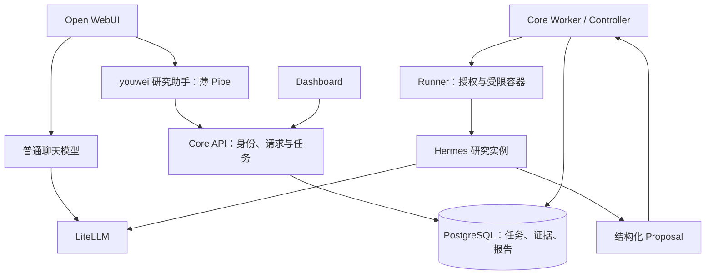

# Open WebUI 与 Hermes 集成调研

调研日期：2026-10-03（UTC）；固定源码采集从 15:04 UTC 开始。  
项目基线：`50dc5c3`；Hermes 登记基线：`7fa45eb349a1a6f1eebc010b3fef0a9d996f386a`。  
性质：技术调研与方案建议；不构成部署、上游升级或正式研究版本批准。

## 0. 用户目标澄清：知识沉淀是主线

用户于本次讨论进一步明确：使用 Hermes 的主要目标是知识沉淀，研究只是其中一个应用。下文原先围绕 S12 得出的结论仅适用于受控美股研究入口，不能外推为所有 Hermes 对话都必须提交 Core 研究任务。

据此调整建议：以具有持久会话、记忆和知识工具的**个人 Hermes 实例**承接日常对话、阅读整理、知识检索与方法复用；现有 Core 作为可调用的受控研究能力。Open WebUI 可经 Hermes 原生 API 连接个人实例；Hermes 自带 UI 也是入口候选。知识保存到哪里，取决于用户现有知识库习惯，尚不预选新存储系统。

知识沉淀需要分别保存：①可回读的原始材料与来源；②整理后的主题笔记、结论及修订记录；③可复用的方法/技能；④简短的用户偏好与项目背景。Hermes 内置 Memory 是有容量上限的长期上下文，适合第④类及少量关键事实，不能代替整个资料库；Skills 适合按需加载的知识和操作方法。[固定版本 Memory 文档](https://github.com/NousResearch/hermes-agent/blob/7fa45eb349a1a6f1eebc010b3fef0a9d996f386a/website/docs/user-guide/features/memory.md)、[官方 Skills 文档](https://hermes-agent.nousresearch.com/docs/user-guide/features/skills/)

当前 `agent-runtime` 明确使用 `skip_memory=True`、`skip_background_review=True` 和仅平台研究工具的允许列表，这是为了冻结研究输入；它不适合作为个人知识助手的唯一运行模式。建议个人实例使用独立 profile、持久数据目录和经选择的知识工具；已有研究实例保留隔离，不直接共享可变记忆。个人知识整理不套用正式 Campaign 的审批流程；只有内容要改变正式预测行为时，才进入现有版本与验证机制。[研究隔离参数](../../services/agent-runtime/src/youwei_agent_runtime/adapter.py)、[架构 §7](../ARCHITECTURE.md#7-memory-与受控变更)

下一阶段的价值验收应是“读入一份材料 → 写出有来源的知识条目 → 关闭并新建会话 → 正确检索、引用并复用 → 能修改或删除”，而非只验收一份预测报告。以上记录用户目标与设计建议，未开启任何新工具权限、记忆写入、运行实例或生产部署。

## 1. 结论

用户提供的 [agntable 文章](https://www.agntable.com/blog/hermes-agent-open-webui) 展示了一条真实存在的接入方式：Open WebUI 可以把 Hermes 的原生 API Server 当作一个 OpenAI 兼容的模型连接。**本项目固定的 Hermes commit 已经具备该能力，无需仅为接入 Open WebUI 升级 Hermes。** 这由固定版本的 [Open WebUI 接入文档](https://github.com/NousResearch/hermes-agent/blob/7fa45eb349a1a6f1eebc010b3fef0a9d996f386a/website/docs/user-guide/messaging/open-webui.md) 与 [API Server 实现](https://github.com/NousResearch/hermes-agent/blob/7fa45eb349a1a6f1eebc010b3fef0a9d996f386a/gateway/platforms/api_server.py) 交叉支持。

对于本项目的美股研究入口，建议继续现有 S12 的 `Open WebUI Pipe → Core → Controller/Runner → Hermes` 路径。原生直连适合另设通用个人 Agent；它默认建立自己的 Agent、工具、会话与记忆环境，不会自动获得本平台的冻结证据、身份授权、报告版本与正式预测语义。此判断来自上游行为与本项目 [架构](../ARCHITECTURE.md)、[实施计划中的 S12](../IMPLEMENTATION_PLAN.md) 的边界对照，属于方案推论。

## 2. 原生直连：固定版本已经有什么

### 2.1 连接与身份

固定版本文档的连接参数如下；这是上游能力说明，不是本项目部署操作指令：

| 项目 | 核实结果 |
| --- | --- |
| 启用 | `API_SERVER_ENABLED=true` |
| 凭证 | `API_SERVER_KEY`；Open WebUI 使用对应 Bearer key |
| 监听 | 默认 `API_SERVER_HOST=127.0.0.1`、`API_SERVER_PORT=8642` |
| 启动 | `hermes gateway` |
| Open WebUI Base URL | 能从 Open WebUI 服务端访问的 `http://<hermes-host>:8642/v1` |
| 发现与调用 | `GET /v1/models`、`POST /v1/chat/completions` |
| CORS | 服务器之间调用无需浏览器 CORS；不能把 CORS 当作调用者鉴权 |

来源：[固定版本接入文档](https://github.com/NousResearch/hermes-agent/blob/7fa45eb349a1a6f1eebc010b3fef0a9d996f386a/website/docs/user-guide/messaging/open-webui.md)。容器内的 `localhost` 指向该容器，当前项目应使用声明式受限网络和服务名，不能照抄教程中的 host 网络或浮动镜像标签。

源码 `_api_key_passes_startup_guard()` 还会拒绝缺失、明显占位或长度不足 16 字符的 key；即便只监听 loopback 也要求有效凭证。`_check_auth()` 处理 Bearer 校验。教程里的示例 secret 不能当作可用生产配置。[固定 API Server 源码](https://github.com/NousResearch/hermes-agent/blob/7fa45eb349a1a6f1eebc010b3fef0a9d996f386a/gateway/platforms/api_server.py#L4363)

### 2.2 请求执行位置与工具

`_create_agent()` 在 API Server 进程一侧创建 `AIAgent`，使用 `api_server` 平台的工具配置，接入自身 `session_db`、`memory_manager` 与可配置 fallback chain。该路径没有本项目 adapter 的研究隔离参数。工具运行于 API Server 所在环境，实际范围取决于其配置；终端、文件和记忆等能力不能因为增加了 HTTP 前端就视为隔离。

因此，现有 LiteLLM 与 Hermes API Server 的职责不同：前者是模型出口；后者会组织 Agent 循环并执行工具。让 Open WebUI 直连 Hermes 不会自动接入 Core 的快照工具或 Runner 授权。[固定 `_create_agent()`](https://github.com/NousResearch/hermes-agent/blob/7fa45eb349a1a6f1eebc010b3fef0a9d996f386a/gateway/platforms/api_server.py#L2321)

### 2.3 会话、持久任务和取消

不能把原生 Hermes 描述成“只有无状态聊天、没有持久任务”：

- Chat Completions 的请求携带 `messages`；Responses 另有 `previous_response_id` 与会话链机制。
- 固定实现包含 SQLite `ResponseStore`、会话数据库与 `RunIdempotencyStore`；注册了 `/v1/runs`、状态、事件流和停止等端点。
- 固定文档说明 Runs 的 `Idempotency-Key` 可跨重启重放；相同 key、不同内容返回冲突；停止先进入 `stopping`，执行结束后转为 `cancelled`。

来源：[固定 API Server 的存储与路由](https://github.com/NousResearch/hermes-agent/blob/7fa45eb349a1a6f1eebc010b3fef0a9d996f386a/gateway/platforms/api_server.py)、[固定 Runs 文档](https://github.com/NousResearch/hermes-agent/blob/7fa45eb349a1a6f1eebc010b3fef0a9d996f386a/website/docs/user-guide/features/api-server.md#runs-api-streaming-friendly-alternative)。本次未运行这些端点，因此不把文档声明当作本项目的恢复、取消实测。

这些能力管理的是 Hermes 自己的执行与会话。它们不等于本项目 PostgreSQL 中的租户授权、attempt fencing、FrozenEvidence、ResearchRelease、版本化报告或预测封存。若改为原生直连承载平台研究，还需要重新设计这些业务契约的接入；不能仅换一个 Base URL 就宣称等价。

### 2.4 流式与默认配置

固定版本文档支持 SSE；Chat Completions 除标准文本 chunk，还可发送自定义 `hermes.tool.progress` 事件。严格客户端可通过配置关闭该附加事件。Responses 可提供结构化工具事件。当前固定 Open WebUI 版本对这些事件的实际展示仍需专项验收，不能以“OpenAI 兼容”代替测试。[固定 API 文档](https://github.com/NousResearch/hermes-agent/blob/7fa45eb349a1a6f1eebc010b3fef0a9d996f386a/website/docs/user-guide/features/api-server.md)

API Server 有自身并发上限，固定文档默认值为 10。这个值并非本项目容量结论；SG 4 vCPU / 7.8 GB 上应继续使用已测的保守资源配置。用户级长期记忆还可通过 `X-Hermes-Session-Key` 关联，原生记忆不能自动成为本项目正式研究上下文。[固定配置与记忆说明](https://github.com/NousResearch/hermes-agent/blob/7fa45eb349a1a6f1eebc010b3fef0a9d996f386a/website/docs/user-guide/features/api-server.md#long-term-memory-scoping-x-hermes-session-key)

## 3. 当前文档与固定实现的区别

本次也读取了 [Hermes 当前 API 文档](https://hermes-agent.nousresearch.com/docs/user-guide/features/api-server/) 和 [当前 Open WebUI 接入文档](https://hermes-agent.nousresearch.com/docs/user-guide/messaging/open-webui/)。它们是会变化的公开页面，本报告的兼容性结论以完整 SHA 对应文档及源码为依据，不把当前网页视为部署版本证明。

本项目现有镜像入口为 `youwei-agent-runtime research-once`，通过受控 stdin/stdout 契约执行。上游源码具有 `hermes gateway` 并不表示当前精简镜像已按该模式安装依赖、启动 API 或完成网络/工具隔离验收。无需为了这次调研修改该入口。

## 4. 当前项目已经实现什么

以下结论基于本地 `50dc5c3`，描述源码能力；不代表聊天入口已完成线上验收。

| 环节 | 已实现行为 | 当前边界 |
| --- | --- | --- |
| Open WebUI Pipe | 研究/状态/取消命令，提交、轮询、摘要与 Dashboard 链接 | 输入严格匹配 `研究 AAPL D20` 之类的格式，无自然语言追问 |
| Core API | 持久任务、租户鉴权、幂等、查询、取消、报告版本读取 | 请求仅有 ticker/horizon/benchmark，无问题正文或父报告字段 |
| Core Worker | 按提交时间冻结证据、计算量化输入、调用 Runner、校验引用并保存报告 | 当前探索证据是 daily bars，量化输入使用登记在探索配置中的载具版本；不能当作正式 Logistic/Ridge Campaign 结果 |
| Hermes | 消费 FrozenEvidence，返回结构化 Proposal；报告记录 prompt/配置/返回模型标识 | 平台研究工具允许列表，关闭自动记忆；没有自动继承聊天历史 |
| Dashboard | 完整研究报告、证据、限制、版本查看 | 读取 Core 已保存的结果 |

源码依据：[Pipe](../../integrations/openwebui/youwei_research_pipe.py)、[Core API](../../youwei_core/api/app.py)、[探索服务](../../youwei_core/ledger/exploratory.py)、[研究简报与隔离参数](../../services/agent-runtime/src/youwei_agent_runtime/adapter.py)。

目前 `POST /v1/research` 不接收研究问题正文。仅在 Pipe 里放宽正则、接收一句任意中文，仍不能把“重点分析哪项风险”传给 Hermes。需要先扩展 Core 的探索请求和冻结上下文，再做对话入口。当前证据也没有新闻、财报或 SEC 原文；界面接通后仍应说明数据覆盖，不能以模型知识补作已核实事实。

## 5. 方案对照与推荐链路

| 方案 | 本项目需要做的事 | 判断 |
| --- | --- | --- |
| 原生 Open WebUI → Hermes API | 独立 API 运行配置、工具/记忆与权限配置；若承担平台研究，还需补 Core 业务契约 | 适合另行隔离的通用 Agent，不作为现有 S12 的替换方案 |
| Open WebUI → 薄 Pipe → Core → Hermes | 复用已写的 S12，补问题/追问、请求身份、进度、入口验收 | **推荐现在采用**，新增代码集中在本仓库 |
| Open WebUI → Core 前的 OpenAI-compatible 适配层 → Core → Hermes | 实现模型发现、聊天协议、流与持久任务映射 | 多种聊天客户端都需要同一入口时再考虑；当前无须增加服务 |

Open WebUI 的模型列表可以显示“youwei 研究助手（Hermes）”；它表示一个研究服务入口，底层模型仍按已登记配置使用 `glm-5.3`。Pipe 在 Open WebUI 进程内运行，只做协议适配和展示，不在其中运行 Hermes、访问业务数据库或持有 Runner 签发密钥。固定版本源码已支持 Pipe 作为可选模型及按签名注入参数，无需 fork Open WebUI 或部署额外的 Pipelines 服务。[Open WebUI v0.6.36 functions.py](https://github.com/open-webui/open-webui/blob/v0.6.36/backend/open_webui/functions.py#L75)

如以后确实需要通用 Hermes 助手，可作为另一个独立入口评估原生 API，使用独立 profile/存储/凭证与受限执行环境。其聊天记忆和工具结果不自动成为平台事实或正式预测上下文。该可选方向没有在本次实施。

## 6. 优先补齐的四项交互能力

### 6.1 让用户的问题真正进入研究任务

建议为探索请求增加受长度限制的 `question` 和可选父报告引用（研究 ID + 报告版本）。Core 保存问题、校验父报告归属、固定证据和配置后，构造对应研究简报；用户问题作为研究需求输入，不能覆盖租户、工具权限或正式发布规则。

对话可形成如下行为（设计目标，当前尚不支持）：

1. “研究 TGT 未来一个月，重点解释波动风险” → 新研究任务。
2. “解释刚才结论的依据” → 引用明确的已保存报告版本与原冻结证据。
3. “使用最新数据重新研究” → 创建新任务、新截止时点与快照，并保留旧报告。

首版用已有采集覆盖的证券演示；新证券进入研究采集范围需由 Core 的数据接入能力落实。探索性追问可以使用显式选择、受限且可追溯的上下文，不需要把整段聊天历史或 Hermes 自动记忆传入正式 Campaign。

### 6.2 修正幂等键：相同文字不等于相同请求

现有 Pipe 用 `owui:{user_id}:{hash(text)}`：同一用户在不同聊天、不同日期提交相同文字也会取回旧研究。建议改为绑定认证主体与稳定的请求身份（chat + turn/request），同次提交的网络重试复用键，新消息或显式“重新研究”使用新键；载荷冲突仍由 Core 拒绝。

`v0.6.36` 可注入 `__metadata__`、`__chat_id__`、`__message_id__`；实际选择哪个字段作为稳定请求身份，需验收发送、重发、重新生成与临时聊天场景，不能假设所有 ID 在重试时都不变。缺少稳定 ID 时应显式处理，不回退为永久文本去重。[固定参数注入代码](https://github.com/open-webui/open-webui/blob/v0.6.36/backend/open_webui/functions.py#L207)

### 6.3 立即回执、真实进度、完成摘要与显式取消

当前 Pipe 等待最多 90 秒，期间没有状态事件；最新 `50dc5c3` 提交说明中的实际多轮研究耗时达到 10–16 分钟。应立即显示研究 ID，用 `__event_emitter__` 展示 Core 已确认的排队/执行/完成状态，等待达到上限后返回可继续查询的任务链接。只有 Core 已记录具体阶段时才显示“冻结证据”“校验引用”等细分进度，不编造百分比。[Pipe 轮询实现](../../integrations/openwebui/youwei_research_pipe.py)、[官方事件说明](https://docs.openwebui.com/features/extensibility/plugin/development/events/)

“状态”查到成功任务时应同时读取摘要，而不只给链接。页面关闭或停止前端等待默认只停止观察；明确的“取消研究”才调用 Core 取消接口。取消最终状态由 Core/Runner 确认，不能因停止输出就声称模型或计算已停止。UI 事件是展示通道，恢复时仍读取 Core，不能依赖浏览器保存唯一任务映射。

### 6.4 区分用户研究与 Open WebUI 后台任务

当前 Pipe 未接收 `__task__`。固定 `v0.6.36` 在标题、标签和后续问题生成中会携带 task 元数据，应显式将这些调用与研究提交分流。原则是后台 UI 辅助任务不得创建研究作业；可选择确定性的标题响应、明确禁用，或经已配置的辅助模型处理，不能默认触发完整研究。这是应补护栏，本次未观察到生产误建事件。[固定 tasks.py](https://github.com/open-webui/open-webui/blob/v0.6.36/backend/open_webui/routers/tasks.py#L142)、[固定参数注入](https://github.com/open-webui/open-webui/blob/v0.6.36/backend/open_webui/functions.py#L217)

## 7. 接入边界与落地顺序

- 当前单所有者 Pipe 使用服务端 tenant key，`__user__.id` 仅参与幂等，不构成 Core 的逐用户身份授权。多用户前应建立可信身份映射和报告访问控制；不能把模型提交的 user_id 当认证。现有 API 以 tenant role 校验，不能宣称已有研究专属细粒度 scope。
- 保留专用研究网关 key 与已有请求/并发限额。Pipe 不携带网关 master key，不因普通聊天开放而扩大 Runner 或数据库的可达范围。此次不恢复已删除的金额预算维度。
- Open WebUI 管理面配置和镜像版本分别登记。教程使用浮动 `main` 镜像不适用于本项目；连接配置受持久配置机制影响，修改 env 不总能覆盖已有管理面设置。[官方持久配置说明](https://docs.openwebui.com/reference/env-configuration/)
- **第一步**：以实际部署状态为准，完成现有命令式 Pipe 的浏览器到报告验收，覆盖重试/取消/断线查询、证据定位和 Ledger 零写入。使用有数据覆盖的证券。
- **第二步**：实现研究问题与父报告契约，同步幂等、后台任务分流与进度反馈；按固定 Open WebUI 版本验收。
- **第三步**：扩展新闻/SEC/财务等受控证据及对应引用解析，让自然语言问题有相应数据基础；按需求决定是否增加独立的通用 Hermes 入口或多客户端协议适配。

优先复用已有服务和受控运行时。当前缺口集中在业务问题契约与聊天交互，单纯新增原生 Hermes API 进程不会补齐这些项目能力。

## 8. 核实范围与限制

- 已检查本地工作区状态、CONTEXT、架构边界与 S12 实施记录；工作区开始时干净。
- 已从 GitHub 官方 raw 地址获取固定 SHA 下的 `gateway/platforms/api_server.py`、`gateway/config.py`、`gateway/run.py` 及两份集成/API 文档并阅读相关实现；下载缓存仅放在 `/tmp/youwei-hermes-webui-research/`。
- 本次没有 SSH、生产探测、收费 LLM 调用、运行原生 Hermes API Server 或改变任何上游版本。
- 仓库工程状态与部署记录存在不同步：`50dc5c3` 的提交说明报告 Core/Runner 已滚动，部分锁文件/运行说明仍写暂存；因此本报告不据此确认当前线上镜像或 Open WebUI 研究入口已启用。线上状态应由后续只读核验解决。
- 研究建议不改变正式 Phase 1A 的来源集合、release 或封存规则，也不把探索报告计为正式前向预测。
- 实际运行 `.venv/bin/python -m pytest -q tests/test_openwebui_pipe.py`：**11 passed**，使用离线 MockTransport，只证明现有 Pipe 行为测试通过；不证明自然语言追问、浏览器事件显示或生产入口已完成。
